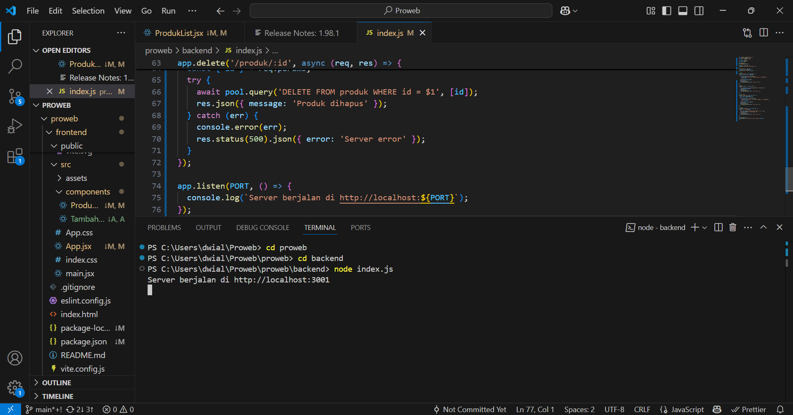
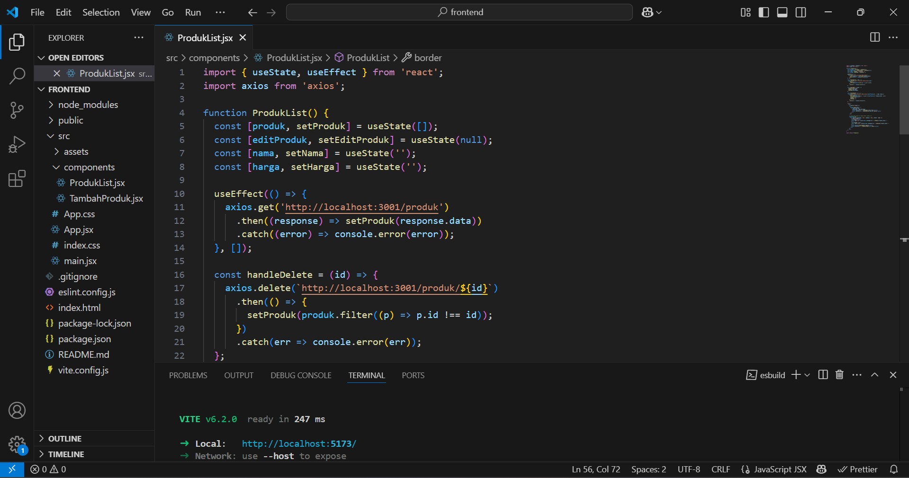
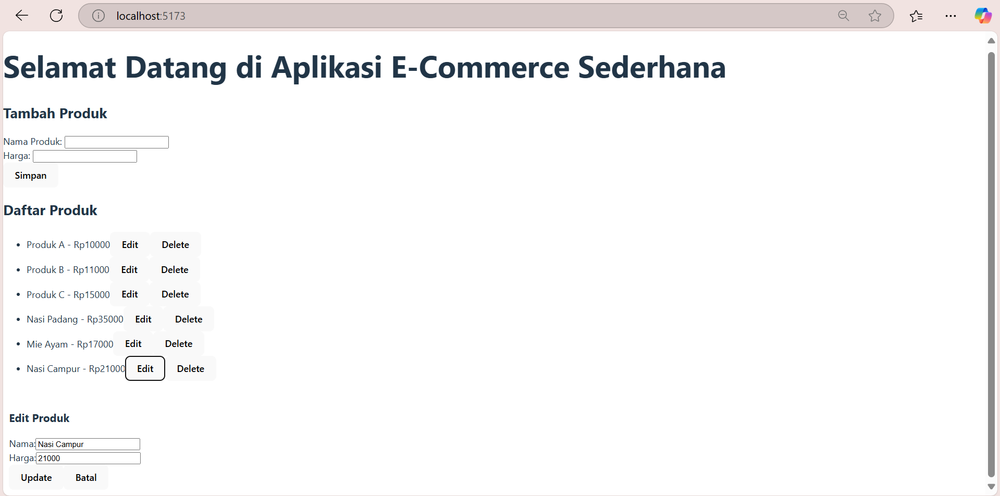
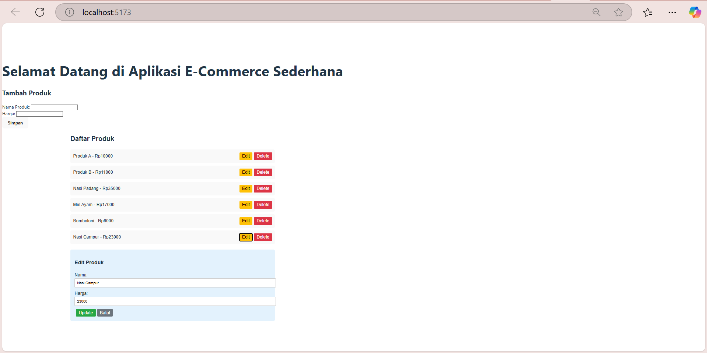
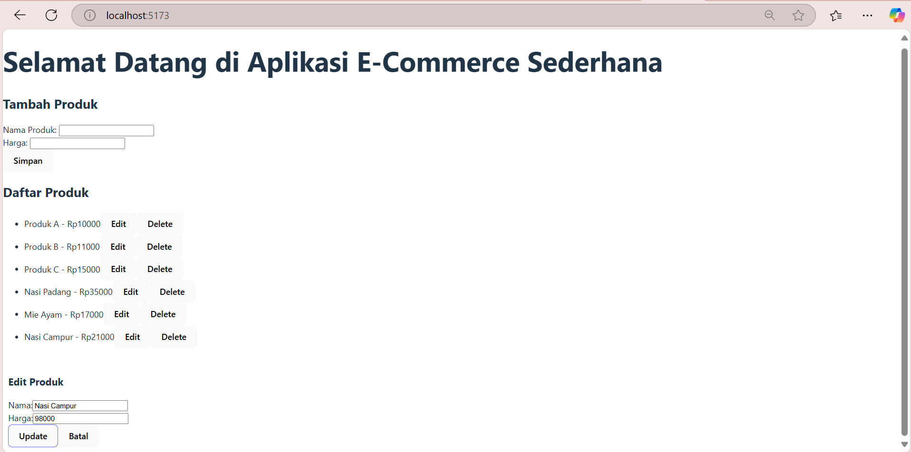
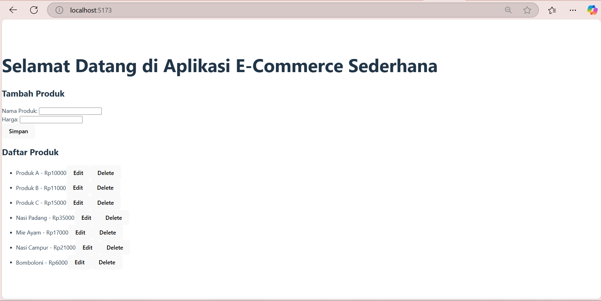
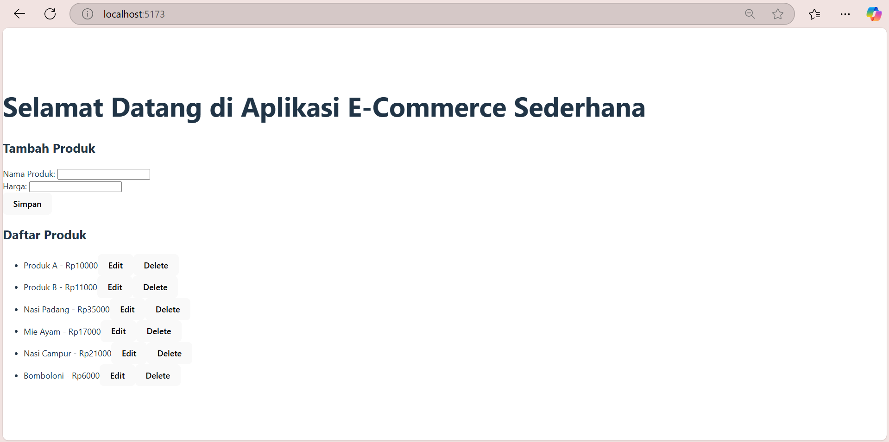
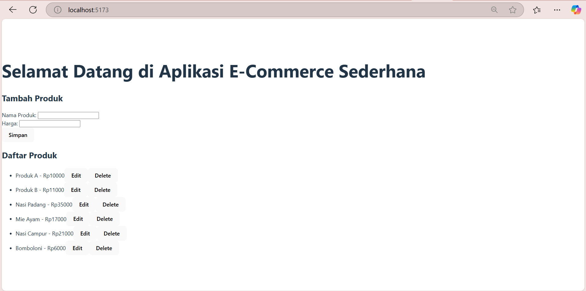

# Tugas 7 Pemrograman Web
### Nama : Micka Mayulia Utama
### NIM : 10231053
### Link Github : `https://github.com/mickamayulia/proweb`

## Langkah-langkah praktikum
### A. Backend: Menambahkan Endpoint PUT & DELETE di index.js
Kita akan menambahkan endpoint untuk mengedit produk (PUT) dan menghapus produk (DELETE) di backend. Tujuan:
- Memungkinkan pengguna untuk mengedit atau memperbarui data produk yang sudah ada.
- Mengambil id produk dari parameter URL dan data baru dari req.body.
- Mengupdate nama dan harga produk di database.
- Mengembalikan data produk yang telah diperbarui.
- Menghapus produk dari database berdasarkan id yang diberikan dalam parameter URL.
- Mengirim respons konfirmasi bahwa produk telah dihapus.
### Hasil Screenshoot
1. Tampilan kode setelah di tambahkan endpoint, jalankan terminal dengan `node index.js` dan link server localhost akan diberikan.

2. Klik link localhost http://localhost:3001 dan akan muncul seperti gambar dibawah ini pada browser

### B. Frontend: Menambahkan UI untuk Update & Delete Produk
Perbarui kode pada ProdukList.jsx sesuai yang ada pada modul 7 praktikum. Tujuan:

Menampilkan daftar produk dengan data yang diambil dari backend (GET /produk). Tujuan:
- Menambahkan tombol "Delete" untuk setiap produk.
- Ketika tombol "Delete" ditekan: Mengirim permintaan DELETE ke backend (DELETE /produk/:id). Dan menghapus produk dari state agar tampilan langsung diperbarui tanpa harus me-refresh halaman.
### Hasil Screenshoot
1. Tampilan kode setelah diperbarui, jalankan terminal dengan `npm run dev` dan link localhost server akan diberikan.

2. Klik link localhost http://localhost:5173/ dan akan muncul seperti gambar di bawah ini pada browser.
Tanpa CSS

Dengan CSS Sederhana

### C. Hasil review CRUD
### Hasil Screenshoot
1. Mengedit produk list Nasi Campur dari harga Rp 21000 menjadi Rp 98000.

2. Menambah produk baru yaitu Bomboloni dengan harga Rp 6000.

3. Menghapus Produk C dengan harga Rp 15000.

4. Membaca daftar list produk yang telah diperbarui.

